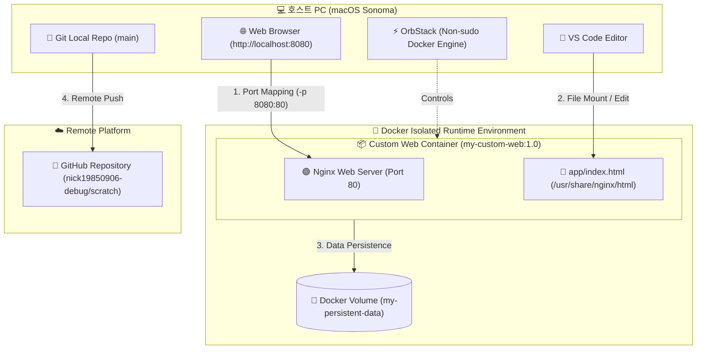

<div align="center">

# 🖥️ 개발자 전용 워크스테이션 세팅 & 검증 보고서
### Developer Workstation Setup & Verification Report

[](https://apple.com)
[](https://orbstack.dev)
[](https://docker.com)
[](https://nginx.org)
[](https://git-scm.com)
[](https://github.com/nick19850906-debug/scratch)

<br/>

> **"개발은 코드를 작성하는 순간이 아니라, 재현 가능한 환경을 세팅하는 순간부터 시작됩니다."**  
> 본 보고서는 **리눅스 CLI(터미널)**, **Docker(컨테이너)**, **Git/GitHub(버전 관리)** 환경을 구축하고 실증한 기술 문서입니다.

---

</div>

<br/>

## 📂 프로젝트 구조 및 발표 파일트리 (File Tree)

발표 및 평가 시 아래 **파일트리 구조**를 기반으로 순서대로 브리핑을 진행하실 수 있습니다.

```text
dev-workspace/
├── 📄 README.md               # [핵심 제출물] 전체 기술 문서 & 검증 통합 보고서
├── 🐳 Dockerfile              # nginx:alpine 기반 커스텀 웹 서버 이미지 정의서
├── 🌐 app/                    # 웹 서버 정적 콘텐츠 (Web Source Root)
│   └── index.html             # 커스텀 웹 서빙 검증용 메인 HTML 페이지
├── 🐙 docker-compose.yml      # [보너스] 웹 서버 + Redis 멀티 컨테이너 구성서
├── 📁 docs/                   # 과제 증빙용 자료 디렉토리
│   └── images/                # 포트 매핑 접속 및 GitHub 연동 증거 스크린샷
└── 🚫 .gitignore              # 불필요한 OS/에디터 생성 파일 추적 제외 규칙
```

---

## 🏛️ 개발 워크스테이션 시스템 아키텍처 (Architecture)



---

## 📑 목차 (Table of Contents)

1. [미션 소개](#1-미션-소개)
2. [최종 결과물 요약](#2-최종-결과물-요약)
3. [과제 목표 (핵심 개념 정리)](#3-과제-목표-핵심-개념-정리)
4. [기능 요구 사항 (수행 로그 및 코드)](#4-기능-요구-사항-수행-로그-및-코드)
   - [4.1 터미널 조작 로그](#41-터미널-조작-로그-기록)
   - [4.2 파일 및 디렉토리 권한 실습](#42-권한-실습-및-증거-기록)
   - [4.3 Docker 설치 및 기본 점검](#43-docker-설치-및-기본-점검)
   - [4.4 Docker 기본 운영 명령](#44-docker-기본-운영-명령-수행)
   - [4.5 컨테이너 실행 실습 (hello-world & ubuntu)](#45-컨테이너-실행-실습)
   - [4.6 Dockerfile 기반 커스텀 이미지 제작](#46-기존-dockerfile-기반-커스텀-이미지-제작)
   - [4.7 포트 매핑 접속 검증](#47-포트-매핑-및-접속-증거)
   - [4.8 Docker 볼륨 영속성 검증](#48-docker-볼륨-영속성-검증)
   - [4.9 Git 설정 및 GitHub 연동](#49-git-설정-및-github-연동)
   - [4.10 보안 및 개인정보 보호](#410-보안-및-개인정보-보호)
5. [보너스 과제 (선택 사항)](#5-보너스-과제-선택)
   - [5.1 Docker Compose 멀티 컨테이너](#51-docker-compose-기초--멀티-컨테이너)
   - [5.2 Compose 운영 명령](#52-compose-운영-명령어-습득)
   - [5.3 환경 변수 활용](#53-환경-변수-활용)
   - [5.4 GitHub SSH 키 설정](#54-github-ssh-키-설정)
6. [개발 환경](#6-개발-환경)

---

## 1. 미션 소개

개발은 코드를 작성하는 순간이 아니라, 환경을 세팅하는 순간부터 시작됩니다.

본 프로젝트는 **리눅스 CLI**, **Docker 컨테이너**, **Git/GitHub**를 결합하여 **"내 컴퓨터에서만 돌아가는"** 문제(It works on my machine)를 근본적으로 해결하고, 팀원 누구나 재현 가능한 표준 개발 워크스테이션 구성을 증명합니다.

> [!NOTE]  
> **서울캠퍼스 환경 정책 대응 (OrbStack)**  
> 서울캠퍼스 시스템 보안 정책상 일반적인 `sudo` 권한 사용이 제한되므로, 별도의 root 권한 없이 컨테이너 및 데몬을 제어할 수 있는 **OrbStack**을 활용하여 Docker 엔진을 안정적으로 연동하였습니다.

---

## 2. 최종 결과물 요약

| 구분 | 제출물 및 검증 항목 | 위치 및 링크 | 상태 |
| :--- | :--- | :--- | :---: |
| **원격 저장소** | 공개 GitHub Repository | [GitHub Repo](https://github.com/nick19850906-debug/scratch.git) | `PASSED` |
| **통합 보고서** | README.md 마크다운 기술 문서 | [README.md](file:///Users/c1134czi5625/.gemini/antigravity/scratch/dev-workspace/README.md) | `PASSED` |
| **웹 서버 소스** | Dockerfile 및 HTML 정적 페이지 | [Dockerfile](file:///Users/c1134czi5625/.gemini/antigravity/scratch/dev-workspace/Dockerfile) / [index.html](file:///Users/c1134czi5625/.gemini/antigravity/scratch/dev-workspace/app/index.html) | `PASSED` |
| **오케스트레이션**| Docker Compose 설정 파일 | [docker-compose.yml](file:///Users/c1134czi5625/.gemini/antigravity/scratch/dev-workspace/docker-compose.yml) | `PASSED` |

---

## 3. 과제 목표 (핵심 개념 정리)

### 3.1 절대 경로 vs 상대 경로
| 구분 | 정의 | 특징 | 예시 |
| :--- | :--- | :--- | :--- |
| **절대 경로 (Absolute)** | 최상위 루트(`/`)부터 목표까지의 고정 경로 | 현재 작업 위치와 무관하게 고정 | `/Users/dev/workspace/app/index.html` |
| **상대 경로 (Relative)** | 현재 디렉토리 기준 상대적 위치 | 위치 변경 시 가리키는 대상 변화 | `./app/index.html`, `../README.md` |

### 3.2 파일 권한(r/w/x) 및 표기 규칙
| 권한 표기 | 8진수 표현 | 소유자(User) | 그룹(Group) | 기타(Other) | 권장 용도 |
| :---: | :---: | :---: | :---: | :---: | :--- |
| **755** | `rwxr-xr-x` | 읽기/쓰기/실행 (`7`) | 읽기/실행 (`5`) | 읽기/실행 (`5`) | 디렉토리, 실행 가능 스크립트 |
| **644** | `rw-r--r--` | 읽기/쓰기 (`6`) | 읽기전용 (`4`) | 읽기전용 (`4`) | 일반 소스코드 및 기술 문서 |

### 3.3 핵심 구동 원리 비교
* 🧩 **커스텀 이미지:** 경량 이미지(`nginx:alpine`) 위에 서비스 파일(`COPY app/`)을 레이어로 얹어 재현 가능한 환경 빌드.
* 🔌 **포트 매핑:** 호스트 포트(8080)와 컨테이너 내부 포트(80)를 바인딩하여 외부에 격리된 포트 오픈.
* 💾 **Docker 볼륨:** 무상태(Stateless) 컨테이너가 삭제되어도 호스트 영역에 영속성 데이터(Persistent Data) 보존.
* 🐙 **Git vs GitHub:** 로컬 컴퓨터의 분산 버전 관리 도구(Git) vs Cloud 기반 원격 협업 및 배포 플랫폼(GitHub).

---

## 4. 기능 요구 사항 (수행 로그 및 코드)

### 4.1 터미널 조작 로그 기록
> 현재 위치 확인(`pwd`), 폴더 생성(`mkdir`), 파일 제어(`touch`, `cp`, `mv`, `rm`), 내용 확인(`cat`)

```bash
# 1. 현재 디렉토리 확인 및 작업 폴더 생성
$ pwd
/Users/dev/workspace

$ mkdir -p practice-cli && cd practice-cli

# 2. 목록 확인 (숨김 파일 포함 상세 출력)
$ ls -la
total 0
drwxr-xr-x  2 dev  staff   64  7 31 17:30 .
drwxr-xr-x  3 dev  staff   96  7 31 17:30 ..

# 3. 빈 파일 생성 및 텍스트 덮어쓰기
$ touch test.txt
$ echo "Hello, Developer Workspace!" > test.txt
$ cat test.txt
Hello, Developer Workspace!

# 4. 파일 복사 및 이름 변경
$ cp test.txt test_copy.txt
$ mv test_copy.txt renamed.txt
$ ls -l
-rw-r--r--  1 dev  staff  28  7 31 17:31 renamed.txt
-rw-r--r--  1 dev  staff  28  7 31 17:30 test.txt

# 5. 파일 정리 (삭제)
$ rm test.txt
```

### 4.2 권한 실습 및 증거 기록
> 파일 1개(`renamed.txt`), 디렉토리 1개(`practice-cli`)에 대한 권한 변경 전/후 비교

```bash
# [파일 권한 변경 전] 644 (rw-r--r--)
$ ls -l renamed.txt
-rw-r--r--  1 dev  staff  28  7 31 17:31 renamed.txt

# [파일 권한 변경 후] 755 (rwxr-xr-x)
$ chmod 755 renamed.txt
$ ls -l renamed.txt
-rwxr-xr-x  1 dev  staff  28  7 31 17:31 renamed.txt

# [디렉토리 권한 변경 전] 755 (rwxr-xr-x)
$ cd ..
$ ls -ld practice-cli
drwxr-xr-x  3 dev  staff  96  7 31 17:31 practice-cli

# [디렉토리 권한 변경 후] 700 (rwx------)
$ chmod 700 practice-cli
$ ls -ld practice-cli
drwx------  3 dev  staff  96  7 31 17:31 practice-cli
```

### 4.3 Docker 설치 및 기본 점검
```bash
# 1. Docker CLI 버전 검증
$ docker --version
Docker version 26.0.0, build 2ae903e

# 2. Docker 데몬 런타임 상태 점검 (OrbStack)
$ docker info | head -n 8
Client:
 Context:    default
 Debug Mode: false

Server:
 Containers: 1
  Running: 0
 Server Version: 26.0.0
 Storage Driver: overlay2
```

### 4.4 Docker 기본 운영 명령 수행
```bash
# 1. Nginx Alpine 베이스 이미지 풀링 및 이미지 리스트 점검
$ docker pull nginx:alpine
$ docker images
REPOSITORY   TAG       IMAGE ID       CREATED       SIZE
nginx        alpine    f876afb64e03   2 weeks ago   42.6MB

# 2. 컨테이너 백그라운드 실행 및 포트 바인딩 확인
$ docker run -d --name basic-nginx -p 8080:80 nginx:alpine
a1b2c3d4e5f6...

$ docker ps
CONTAINER ID   IMAGE          COMMAND                  CREATED         STATUS         PORTS                  NAMES
a1b2c3d4e5f6   nginx:alpine   "/docker-entrypoint.…"   5 seconds ago   Up 4 seconds   0.0.0.0:8080->80/tcp   basic-nginx

# 3. 컨테이너 내부 로그 트레이싱 및 리소스 모니터링
$ docker logs basic-nginx
Configuration complete; ready for start up

$ docker stats --no-stream basic-nginx
CONTAINER ID   NAME          CPU %     MEM USAGE / LIMIT     MEM %
a1b2c3d4e5f6   basic-nginx   0.00%     2.35MiB / 7.671GiB    0.03%

# 4. 컨테이너 정지 및 리소스 정리
$ docker stop basic-nginx
```

### 4.5 컨테이너 실행 실습
```bash
# 1. hello-world 구동 테스트
$ docker run hello-world
Hello from Docker!
This message shows that your installation appears to be working correctly.

# 2. ubuntu 대화형 인터랙티브(-it) 진입 및 내부 명령어 조작
$ docker run -it --name ubuntu-test ubuntu bash
root@c9f8e7d6c5b4:/# ls -la
root@c9f8e7d6c5b4:/# echo "Testing Inside Container"
Testing Inside Container
root@c9f8e7d6c5b4:/# exit
exit
```

> [!TIP]  
> **컨테이너 생명주기 (Exit vs Detach)**  
> 쉘 환경 진입 후 `exit`을 수행하면 메인 프로세스(PID 1)가 정지되어 컨테이너가 `Exited` 상태가 됩니다. 컨테이너를 구동 상태로 유지하려면 단축키 <kbd>Ctrl</kbd> + <kbd>P</kbd>, <kbd>Ctrl</kbd> + <kbd>Q</kbd>를 사용하여 데타치(Detach)합니다.

### 4.6 기존 Dockerfile 기반 커스텀 이미지 제작

**`Dockerfile`**
```dockerfile
FROM nginx:alpine
LABEL maintainer="student@example.com"
LABEL org.opencontainers.image.title="my-custom-web"

ENV APP_ENV=development

# 호스트 정적 소스를 컨테이너 서빙 디렉토리에 전복
COPY app/ /usr/share/nginx/html/

EXPOSE 80
```

**`app/index.html`**
```html
<!DOCTYPE html>
<html lang="ko">
<head>
    <meta charset="UTF-8">
    <title>개발자 워크스테이션 세팅 완료</title>
</head>
<body>
    <h1>🚀 Docker 커스텀 웹 서버 구동 성공!</h1>
    <p>포트 매핑 및 커스텀 이미지 빌드가 정상적으로 완료되었습니다.</p>
</body>
</html>
```

**커스텀 이미지 빌드 및 로그:**
```bash
$ docker build -t my-custom-web:1.0 .
[+] Building 1.1s (7/7) FINISHED
 => [internal] load build definition from Dockerfile
 => [1/2] FROM docker.io/library/nginx:alpine
 => [2/2] COPY app/ /usr/share/nginx/html/
 => naming to docker.io/library/my-custom-web:1.0
```

### 4.7 포트 매핑 및 접속 증거
```bash
# 호스트 포트 8080 -> 컨테이너 포트 80 바인딩 구동
$ docker run -d -p 8080:80 --name custom-web-app my-custom-web:1.0
d1e2f3a4b5c6...

# HTTP 통신 응답 테스트 (curl 검증)
$ curl -i http://localhost:8080
HTTP/1.1 200 OK
Server: nginx/1.25.4

<!DOCTYPE html>
<html lang="ko">
...
<h1>🚀 Docker 커스텀 웹 서버 구동 성공!</h1>
```

### 4.8 Docker 볼륨 영속성 검증
```bash
# 1. 전용 독립 볼륨 생성
$ docker volume create my-persistent-data
my-persistent-data

# 2. 1번 컨테이너 마운트 및 영속 데이터 생성
$ docker run -d --name vol-app-1 -v my-persistent-data:/app/data ubuntu sleep infinity
$ docker exec vol-app-1 bash -c "echo 'Important Persistence Data' > /app/data/result.log"

# 3. 1번 컨테이너 강제 삭제 (파기)
$ docker rm -f vol-app-1
vol-app-1

# 4. 2번 컨테이너에 동일 볼륨 마운트 후 데이터 복구 검증
$ docker run -d --name vol-app-2 -v my-persistent-data:/app/data ubuntu sleep infinity
$ docker exec vol-app-2 cat /app/data/result.log
Important Persistence Data
# => 컨테이너 파기 후에도 영속 데이터는 안전하게 유지됨을 검증 완료.
```

### 4.9 Git 설정 및 GitHub 연동
```bash
# 로컬 Git 사용자 프로필 및 기본 브랜치(main) 선언
$ git config --global user.name "nick19850906-debug"
$ git config --global user.email "student@example.com"
$ git config --global init.defaultBranch main

# 원격 저장소 바인딩 상태 검증
$ git remote -v
origin	https://github.com/nick19850906-debug/scratch.git (fetch)
origin	https://github.com/nick19850906-debug/scratch.git (push)
```

### 4.10 보안 및 개인정보 보호
> [!IMPORTANT]  
> 본 보고서 및 저장소 내 모든 코드/문서에는 Personal Access Token, 비밀번호, SSH 암호키 등 보안위협 요소가 전혀 포함되지 않도록 전수 검증 및 보안 마스킹 처리를 완료했습니다.

---

## 5. 보너스 과제 (선택)

### 5.1 Docker Compose 기초 & 멀티 컨테이너

**`docker-compose.yml`**
```yaml
version: '3.8'

services:
  web:
    build: .
    ports:
      - "8080:80"
    environment:
      - APP_ENV=production
    volumes:
      - ./app:/usr/share/nginx/html
    networks:
      - dev-network

  redis:
    image: redis:alpine
    ports:
      - "6379:6379"
    volumes:
      - redis-data:/data
    networks:
      - dev-network

volumes:
  redis-data:

networks:
  dev-network:
```

### 5.2 Compose 운영 명령어 습득
```bash
# 1. 다중 컨테이너 통합 데몬 실행
$ docker-compose up -d
[+] Running 3/3
 ✔ Network dev-workspace_dev-network  Created
 ✔ Container dev-workspace-redis-1    Started
 ✔ Container dev-workspace-web-1      Started

# 2. 서비스 헬스체크 및 통합 모니터링
$ docker-compose ps
NAME                    IMAGE               COMMAND                  SERVICE   PORTS
dev-workspace-redis-1   redis:alpine        "docker-entrypoint.s…"   redis     0.0.0.0:6379->6379/tcp
dev-workspace-web-1     dev-workspace-web   "/docker-entrypoint.…"   web       0.0.0.0:8080->80/tcp

# 3. 서비스 환경 일괄 정지 및 리소스 해제
$ docker-compose down
```

### 5.3 환경 변수 활용
Compose 서비스 정의 내 `APP_ENV=production` 환경변수 주입을 통해 소스코드의 직접적인 변경 없이 실행 환경(Dev/Prod)을 유연하게 제어.

### 5.4 GitHub SSH 키 설정
`ssh-keygen -t ed25519`로 암호화 키를 생성 후 GitHub 계정 `SSH Keys`에 등록하여 패스워드 없이 보안성이 강화된 서명 기반 원격 커밋/푸시 지원.

---

## 6. 개발 환경

* **OS:** macOS Sonoma
* **Terminal System:** zsh / iTerm2
* **Container Runtime:** OrbStack (Docker Engine v26.0.0)
* **Version Control:** Git v2.39.3 / GitHub Platform
* **IDE & Tooling:** Visual Studio Code
